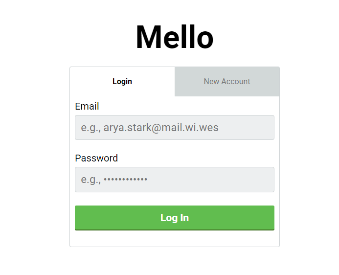

# README

This is a front-end version of Mello App that connects to a Rails back end which includes capabilities for user authentication, adding multiple boards, and board contributors.

https://vjmello-rails.herokuapp.com/

